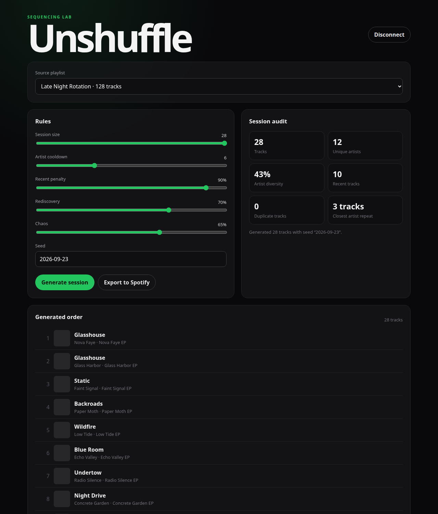
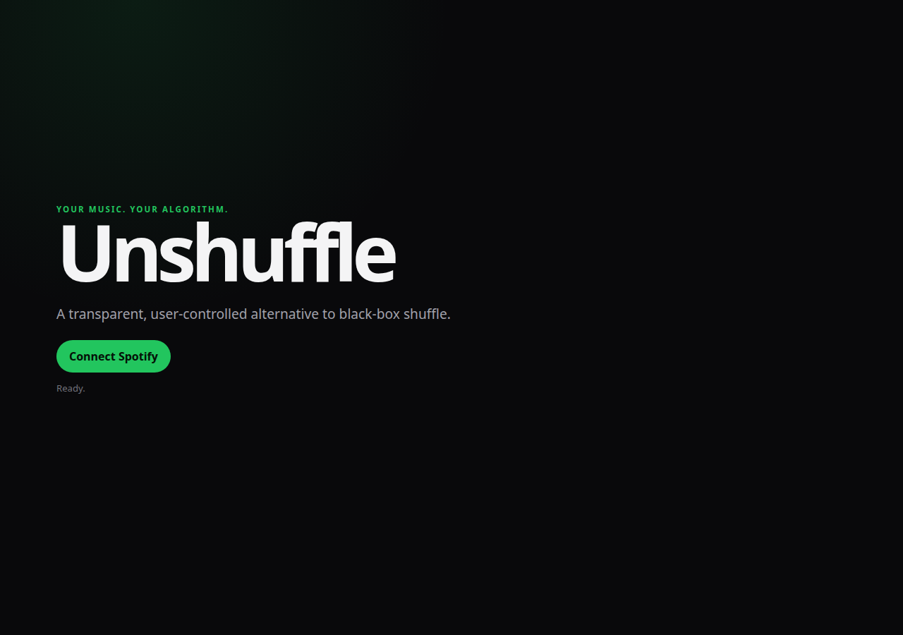

# Unshuffle

**Your music. Your algorithm.**

[](https://github.com/ariel-veraas/unshuffle/actions/workflows/ci.yml)
[](LICENSE)


Unshuffle is an open-source music sequencing engine built around one question: what if shuffle were transparent and configurable instead of a black box?

It connects to Spotify, lets you choose one of your playlists, applies explicit sequencing rules, audits the generated session, and can export that exact order back to Spotify.



## Try it without a Spotify account

Click **Try the demo · sample data** on the landing screen to explore every rule, the sequencing engine and the session audit with fixture data — no Spotify login required. It's the fastest way to see how the engine behaves before connecting a real account.



## Features

- Spotify OAuth with Authorization Code + PKCE
- No client secret shipped to the browser
- Playlist import and recent-listening context
- Deterministic sessions using reusable seeds
- Artist cooldown controls
- Recent-track penalties
- Rediscovery weighting
- Adjustable chaos
- Session audit metrics
- Export to a new private Spotify playlist
- Demo mode with sample data — no Spotify account needed to explore the engine
- Responsive web interface
- Automated engine tests and CI

## Why Unshuffle?

Randomness and good sequencing are not the same thing.

A mathematically random playlist can still feel repetitive. Unshuffle treats sequencing as a constraint-and-scoring problem, then exposes those rules to the listener instead of hiding them behind a single shuffle button.

The Spotify integration is deliberately isolated from the sequencing engine. The core algorithm understands tracks, listening context and rules, which keeps it reusable for other music sources.

## Architecture

```text
Spotify Web API
      │
      ▼
src/spotify/
OAuth PKCE + API adapter
      │
      ▼
src/engine/
seeded PRNG + sequencing + audit metrics
      │
      ▼
React UI
controls + preview + export
```

## Run locally

### Requirements

- Node.js 22+
- Spotify Premium account
- Spotify Developer application

### Setup

```bash
git clone https://github.com/ariel-veraas/unshuffle.git
cd unshuffle
npm install
cp .env.example .env
```

Add your Spotify Client ID:

```env
VITE_SPOTIFY_CLIENT_ID=your_client_id
VITE_SPOTIFY_REDIRECT_URI=http://127.0.0.1:5173/
```

Add the exact same redirect URI to your Spotify Developer Dashboard.

Run:

```bash
npm run dev -- --host 127.0.0.1
```

Open `http://127.0.0.1:5173/`.

## Deploy

Unshuffle is a static single-page app — no backend or database — so it deploys to [Vercel](https://vercel.com) with zero extra setup:

1. Import the repo in Vercel (it auto-detects the Vite framework).
2. Add the two environment variables from `.env.example` under Project Settings → Environment Variables:
   - `VITE_SPOTIFY_CLIENT_ID`
   - `VITE_SPOTIFY_REDIRECT_URI` — set to your production URL, e.g. `https://unshuffle.vercel.app/` (must include the trailing slash and match exactly, protocol included).
3. In your Spotify Developer Dashboard, add that same URL under **Redirect URIs**.
4. Redeploy so the build picks up the environment variables (Vite inlines them at build time).

Anyone visiting the deployed link can use **Try the demo · sample data** without any Spotify setup. To let others log in with their own account, add them under **Users and Access** in the Spotify app dashboard — new apps stay in Development Mode until Spotify grants extended quota.

## How the engine works

For every position in a session, Unshuffle scores the remaining candidates using:

1. **Recent listening penalty** to reduce tracks Spotify reports as recently played.
2. **Rediscovery boost** for tracks outside that recent window.
3. **Artist cooldown penalty** to stop the same artist from clustering.
4. **Seeded random jitter** controlled by the Chaos setting.

The best candidates form a small selection window and a seeded PRNG selects from it. The result stays variable without becoming opaque, and the same seed can reproduce the same session from the same inputs.

The current algorithm is intentionally understandable. There is no recommendation-model theater hiding a random choice behind an AI label.

## Session audit

Before exporting a sequence, the app reports:

- track count
- unique artist count
- artist diversity ratio
- recently played tracks included
- duplicate-track count
- closest repeat of the same primary artist

## Commands

```bash
npm test
npm run build
npm run dev
```

GitHub Actions runs tests and a production build on pushes to `main` and pull requests.

## Current limitations

- New Spotify Developer applications start in Development Mode, which only allows Spotify accounts explicitly added as testers in the app dashboard. To connect your own account when running locally, add your Spotify email under **Users and Access** in your app settings.
- Spotify Web API capabilities depend on the application's access mode and account eligibility.
- Rediscovery currently uses the recent history Spotify exposes, not a complete lifetime listening archive.
- The first engine focuses on recurrence and sequencing rather than Spotify audio-feature analysis.
- Export creates a new private playlist instead of modifying the source.
- This is an early public version and the scoring model will evolve as real listening sessions are tested.

## Roadmap

- Persistent local listening history
- Fairness and recurrence visualizations
- Album cooldowns
- Rule presets such as Rediscover, Deep Cuts and Maximum Variety
- Import/export of engine settings
- Explain-why-this-track details
- Additional provider adapters
- Session comparison experiments

## Privacy

Tokens and settings stay in the browser. Unshuffle does not require its own backend or database.

## License

MIT
